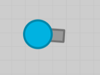
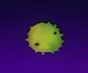
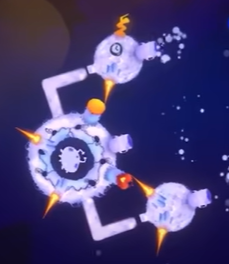
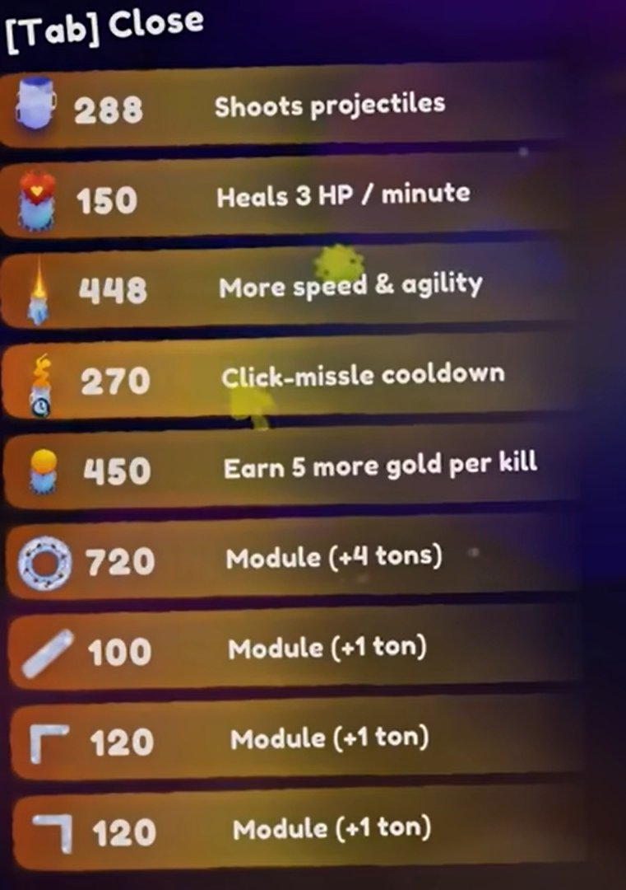
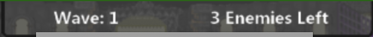

# Piece-By-Piece
---
### Compile & Run instructions:
* Open and run project via processing.
* No command line arguments needed.
* **!Requirement!** Make sure to have fun!<>
---
### Dev Log: (MM-DD-YYYY: "LOG")
* #### Yuxiang Huang:
    *  
* #### Daniel Yentin:
    *  
---
### [Design Document](https://docs.google.com/document/d/1VgnokkQJ6dlN8ZGiPio2rf950HojZwHc50P1fpkQ91U/edit?usp=sharing)

### Brief Summary:
We will attempt to create a shooter game. The MVP will be a basic recreation of the Agar.io clone Diep.io, with a gunship, simple upgrade shop menu, and enemies:

  

By shooting enemies you can gain coins, which you can then spend to buy upgrades for your gunship. The playable map will be bigger than the entire screen, meaning the camera won't just be a static overhead we view but one that moves along with your ship, always keeping it in focus (orthographic camera).

Once we are done with the MVP (~1 week) we can start working on the actual project. The main focus of the actual project is to convert the arbitrary, but simple, shop menu into a ‘module’ shop. You will be able to buy modules for your ship, which you physically attach to it through nodes, and act as upgrades. E.g. a ‘booster module’ would act the same as a Movement Speed upgrade in the MVP. We would also want to add some more enemy variety and replace the random spawning mechanics with waves of enemies".

  
---
### Made by the "We Piece Together" team:
* #### Yuxiang Huang (co-founder)
* #### Daniel Yentin (co-founder)
