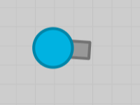
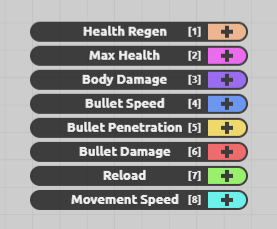
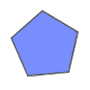

# Piece-By-Piece
---
### Compile & Run instructions:
* Open and run project via processing.
* No command line arguments needed.
* To activate debug mode press the \` key (the one bellow the esc button)
* **!Requirement!** Make sure to have fun!
---
### Dev Log: (MM-DD-YYYY: "LOG")
* #### Yuxiang Huang:
    *  (05-23-2022): "Today I created the backbone of the project with Daniel in class, so I put it in main.(Totally not because I forgot to checkout into the branch I am working in). After class, to minimize merge conflict, I decided to work on the Polygon class and finished the constructors and displays for Square and Triangle, leaving the pentagon for tomorrow."
    *  (05-24-2022): "Today I finished pentagon, the last one of the polygons. Then, I tested their constructor and displays by creating 9 polygons randomly and resolve all the issues I encountered. Lastly, I colored them."
    *  (05-25-2022): "Today I worked on the map by creating 'squares' with lines and started figuring out the dimensions. Then I worked on collisions. First the collision with the border and then the collisions with the polygons. The latter didn't work as intended, and I will fix that tomorrow.
    *  (05-26-2022): "Today I continue working on the collisions between UMOs. It work as intended after we made polygons also able to move. I perfected the collision detection between polygons and player's ship. I also prevented the polygon from stuck with player's ship after collision. Lastly, I tried to do the same for polygon to polygon collisions, but it didn't work. In addition, I scale everything with a unit variable according to the display size."
    *  (05-27-2022): "Today I finished up the collisions between Polygons and ships. Then, I did the bullet collision with polygons and start working on the penetration part."
    *  (05-28-2022): "Today I go through the code and prototype of half of the classes with Daniel and made updates. I also fixed some bugs, helped worked on the display of the shop, and confirmed some of the stats.
    *  (05-29-2022): "Today I finished health regen for gunship, both within and after 30 seconds after taking damage. Then, I related dimensions to unit in all classes and checked the values using online resources. I also added experience bar and changed stats that change with the level of the ship during the process. Lastly, I reworked movement of the ship. 

* #### Daniel Yentin:
    *  (05-23-2022): "Today I began coding the project. I worked on the PBP (main) class as well as the Gunship class. I was able to create a circle that can move smoothly in all 8 directions."
    *  (05-24-2022): "Today I implemented the ability for the gunship to rotate. I also consolidated all the parts of the gunship into one PShape. I tested it and worked out all the issues before merging."
    *  (05-25-2022): "Today I worked on adding the shooting mechanic to the gunship. This meant that I also had to code the Bullet class. I was able to get the basic bullet movement mechanics working as well as a cooldown to the shooting of the gunship. Tomorrow i will work on implementing bullet collision and health mechanics, as well as adding a timer lifespan to the bullets."
    *  (05-26-2022): "Today I worked on general code refactoring. I deleted some unecesary functions and methods, as well as changed the way we were handeling inputs to match Mr. K's  specifications, and finally converting all the polygon shapes into PShape objects to standerdize our method of displaying. I also continued to work on bullet, giving it friction. I helped Yuxiang fix a bug with the polygons not moving."
    *  (05-27-2022): "Today I implemented alot of small to medium features. I made bulets disappear if they hit the border, gave health, maxHealth, and a healthbar to Gunship and Polygon. I then made gunship and bullet collisions with polygons hurt polygons and the gunship. I then implemented Exp and Levels."
    *  (05-28-2022): "Today I mainly worked on the Shop and Stat classes. I transfered all the stats of the gunship into the two classes and included the base stat and the modifier. I also added the ability to level up, which would give you a skill point to spend on upgrading your stats. I also worked on many smaller things like making the gun scale, as well as making acceleration scale with movement speed for smoother movement."
    *  (05-29-2022): "Today I worked on the health regen stat of the Shop but also polished up the rest of the shop and stats. I also began working on the orthographic camera but quickly realized it's going to take a much longer time and probably won't be ready for the MVP. I also changed radius of the gunship to properly scale with its level."
    *  (05-30-2022): "Today I worked on throughly testing the game and code to make sure there werent any major bugs present that could break the game. I also found places where I could optimize some code, particularly in collisionWithUMO, where a stoppin condition could be implemented to speed up collision checks."
---
### [Design Document](https://docs.google.com/document/d/1VgnokkQJ6dlN8ZGiPio2rf950HojZwHc50P1fpkQ91U/edit?usp=sharing)

### Brief Summary:
We will attempt to recreate the shooter game Diep.io (an Agar.io clone) with no multiplayer, but bot enemies that you need to defeat. The MVP will focus on the movement1, stat upgrades2, and level up mechanics (including polygons), and the Final Project will focus on adding tank upgrades and bot enemies.

  

By shooting enemies you can gain experience points, which once you acquire enough off to level up, you gain a skill point that lets you upgrade a stat of your player. The playable map will be bigger than the entire screen, meaning the camera won't just be a static overhead view, but one that moves along with your ship, always keeping it in focus (orthographic camera).

Once we are done with the MVP (~1 week) we can start working on the actual final project. The main focus of the actual project is to add a tree of tank upgrades that allow you to attack differently and have different attributes. We will also want to add bot enemies, which are also tanks.

---
### Made by the "We Piece Together" team:
* #### Yuxiang Huang (co-founder)
* #### Daniel Yentin (co-founder)
